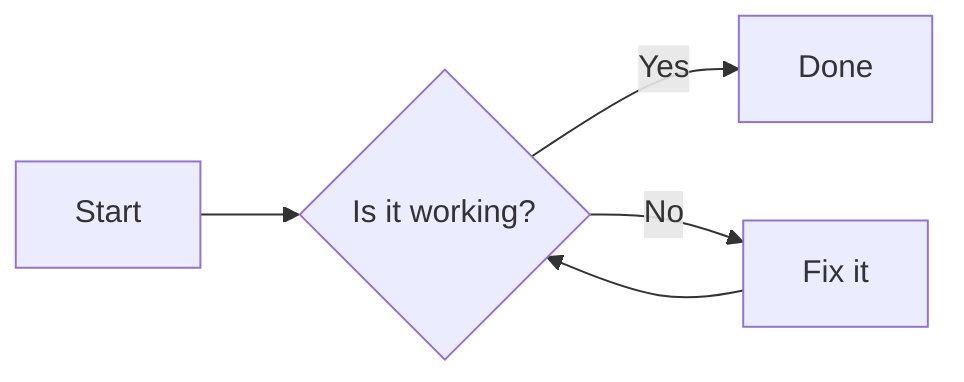

# Diagrams and Math

The viewer renders two types of embedded content: Mermaid diagrams and LaTeX math.

## Mermaid Diagrams

[Mermaid](https://mermaid.js.org/) lets you create diagrams using text-based definitions inside ` ```mermaid ` fenced code blocks.

### Supported diagram types

| Type | Example |
|------|---------|
| Flowchart | `graph TD; A-->B;` |
| Sequence diagram | `sequenceDiagram; A->>B: Hello;` |
| Gantt chart | `gantt; title A Gantt;` |
| Class diagram | `classDiagram; class Animal;` |
| State diagram | `stateDiagram-v2; [*] --> Idle;` |
| Pie chart | `pie; "A" : 40; "B" : 60;` |
| ER diagram | `erDiagram; CUSTOMER ||--o{ ORDER : places;` |
| User journey | `journey; title My journey; section Step;` |
| Gitgraph | `gitGraph; commit; branch;` |

### Example

````markdown

````

Renders as a flow chart. The diagram is theme-aware — it uses a dark theme when the app is in a dark theme, and a light theme otherwise.

## LaTeX Math

LaTeX math is supported in two forms: ` ```math ` / ` ```latex ` fenced code blocks (always rendered), and inline `$...$` / `$$...$$` delimiters (requires the "Render inline math" setting).

### Display math (always on)

Use ` ```math ` or ` ```latex ` fenced code blocks for display math:

````markdown
```math
\int_{-\infty}^{\infty} e^{-x^2} \, dx = \sqrt{\pi}
```
````

### Inline math (opt-in)

Enable "Render inline math" in Settings → Markdown, then use `$...$` for inline math and `$$...$$` for display math directly in text:

```
The mass-energy equivalence is $E = mc^2$.
```

The inline setting is off by default to avoid conflicts with dollar amounts like `$50`.

### Supported KaTeX features

- All standard KaTeX commands (integrals, sums, fractions, matrices, etc.)
- Greek letters: `\alpha`, `\beta`, `\gamma`, etc.
- Operators: `\sum`, `\int`, `\prod`, `\lim`, etc.
- Accents: `\hat`, `\tilde`, `\vec`, etc.
- Environments: `matrix`, `cases`, `align`, etc.

### Notes

- Invalid LaTeX is silently ignored (rendered as raw text).
- Math inside mermaid diagram source blocks is not rendered.

## Implementation

All three features run after the markdown is rendered to HTML, in the post-processing step of `NoteViewer.svelte`:

1. **Scripts** are re-executed (Svelte's `{@html}` skips them).
2. **LaTeX code blocks** (` ```math ` / ` ```latex `) are extracted from `<code class="language-math">` / `<code class="language-latex">` and rendered via `katex.render(source, el, { displayMode: true })`.
3. **Inline LaTeX** (`$...$` / `$$...$$`) is rendered via `katex/dist/contrib/auto-render.mjs` only when the `inlineMath` setting is enabled. The auto-renderer skips `<pre>` and `<code>` elements, so it doesn't interfere with code blocks or mermaid.
4. **Mermaid** diagrams are extracted from `<code class="language-mermaid">` blocks, converted to `<pre class="mermaid">` elements, and rendered via `mermaid.run()`.
