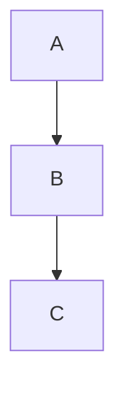

# Welcome to downspace ✦

This is your personal note-taking space. Notes are stored as plain markdown files in the `notes/` directory.

## About downspace

An Obsidian notes replacement. 

- Web based
- Self-hosted
- Single user
  - Intended to be used over tailscale or similar service 
- Full mobile support 
- No database.
  - Just markdown files. 
- Full drop-in replacement for stock Obsidian
  - Or use along side Obsidian.
- No sync, all files live on the server
- No over-engineered extension system from hell
- Full markdown support
- Optional HTML/JS/CSS support
  - Embed iframes 
  - Custom formatting and styling
  - Build simple web apps
- Internal note linking (wiki support)
- Arbitrary file upload and mgmt
- Execute commands on the host shell
- VIM MODE

## Getting Started

- **Create a note**: Click the `+` icon in the sidebar, or create a `.md` file in the `notes/` directory.
- **Edit a note**: Select a note and click the **Edit** button.
- **Delete a note**: Select a note and click the **Delete** button.
- **Copy a note**: Click the **Copy** button in the header to copy note content to clipboard.
- **Organize**: Use directories to group your notes.
- **Search**: Use the search bar at the top of the sidebar to search filenames or full text.
- **Internal links**: Link to other notes like [Pasta](Recipes/Pasta).

## Markdown Support

You can use **bold**, *italic*, `code`, ~~strikethrough~~, and more.

### Lists

- Item one
- Item two
- Item three

### Code blocks

```typescript
function greet(name: string): string {
  return `Hello, ${name}!`;
}
```

### Blockquotes

> The best time to plant a tree was 20 years ago.
> The second best time is now.

### Tables

| Feature | Status |
|---------|--------|
| Create notes | ✅ |
| Edit notes | ✅ |
| Delete notes | ✅ |
| Directories | ✅ |
| Themes | ✅ |
| Mobile support | ✅ |

If you have enabled GFM (Github flavored markdown) you should see the alerts below:

> [!NOTE]  
> Highlights information that users should take into account, even when skimming.

> [!TIP]
> Optional information to help a user be more successful.

> [!IMPORTANT]  
> Crucial information necessary for users to succeed.

> [!WARNING]  
> Critical content demanding immediate user attention due to potential risks.

> [!CAUTION]
> Negative potential consequences of an action.

## Mermaid



## LaTeX Math

[KaTeX](https://katex.org/) renders mathematical expressions inside `$...$` (inline) and `$$...$$` (display) delimiters.

### Inline math

```
The mass-energy equivalence is $E = mc^2$.
```

The mass-energy equivalence is $E = mc^2$.

Renders as: The mass-energy equivalence is $E = mc^2$.

### Display math

```
$$
\int_{-\infty}^{\infty} e^{-x^2} \, dx = \sqrt{\pi}
$$
```

Renders as a centered block formula.

### Supported features

- All standard KaTeX commands (integrals, sums, fractions, matrices, etc.)
- Greek letters: `\alpha`, `\beta`, `\gamma`, etc.
- Operators: `\sum`, `\int`, `\prod`, `\lim`, etc.
- Accents: `\hat`, `\tilde`, `\vec`, etc.
- Environments: `matrix`, `cases`, `align`, etc.

### Notes

- Only `$...$` and `$$...$$` delimiters are supported. `\(...\)` and `\[...\]` do not work because the markdown parser strips the backslashes.
- Invalid LaTeX is silently ignored (rendered as raw text).
- Math inside code blocks (`` ` ``) is not rendered.
- Math inside mermaid diagram source blocks is not rendered.
Enjoy using downspace!
